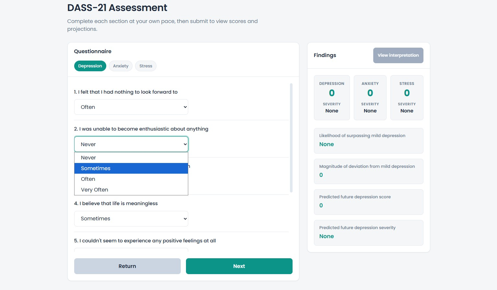
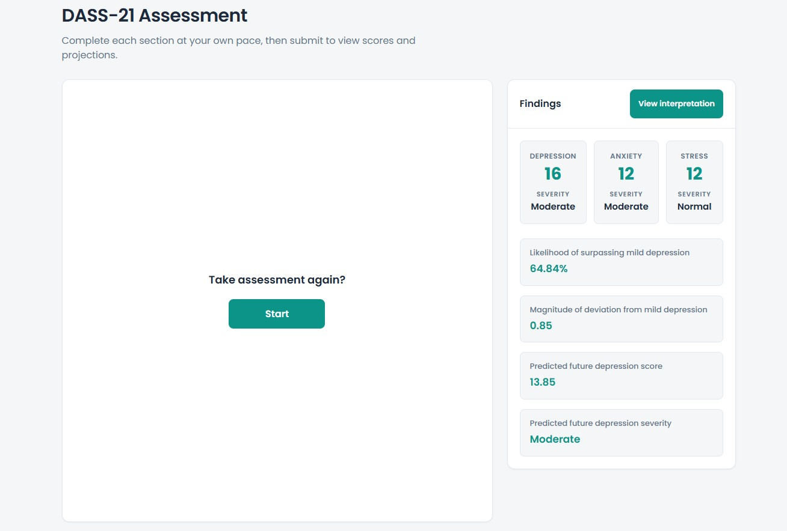
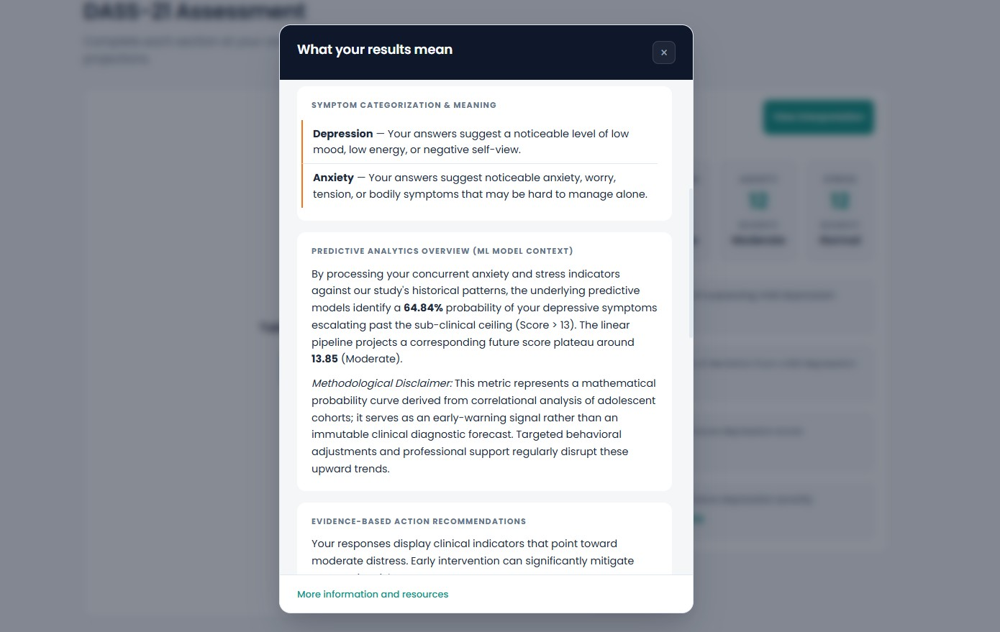

# DASS-21 Amplified

An intelligent mental health assessment web application that extends the standardized DASS-21 psychological screening tool with predictive analytics.

---

## Screenshots

<div align="center">
  
  
  
</div>

---

## Features

- **DASS-21 Assessment** — Guided 21-question questionnaire computing Depression, Anxiety, and Stress scores with severity classification
- **Predictive Analytics** — Logistic and linear regression models forecasting the likelihood and magnitude of depression severity escalation based on anxiety and stress subscores
- **Interpretation & resources** — Plain-language result interpretation on the assessment page and an information page with scoring reference and crisis resources

---

## Tech Stack

| Layer | Technology |
|---|---|
| Backend | Python, Flask, Flask-CORS |
| Machine Learning | scikit-learn (Logistic & Linear Regression), joblib |
| Data Processing | pandas, numpy |
| Frontend | HTML, CSS, JavaScript |

---

## Project Structure

```
dass21-amplified/
├── app.py                      # Flask application entry point
├── dataset.xlsx                # Training data (DASS-21 survey responses)
├── scripts/
│   └── model.py                # DASSModel: training, loading, prediction
├── static/
│   ├── style/
│   │   ├── common.css
│   │   ├── index.css
│   │   └── info.css
│   └── js/
│       ├── index.js
│       └── loading.js
└── templates/
    ├── index.html              # DASS-21 questionnaire & results
    └── info.html               # Information & resources
```

---

## Getting Started

### Prerequisites

- Python 3.8+
- pip

### Installation

1. **Clone the repository**
   ```bash
   git clone https://github.com/Mich-Tapawan/dass21-amplified.git
   cd dass21-amplified
   ```

2. **Install dependencies**
   ```bash
   pip install -r requirements.txt
   ```

3. **Add your dataset**

   Place your `dataset.xlsx` file in the root directory. The file should contain DASS-21 survey responses with columns for each of the 21 questions using the response scale: `Never`, `Sometimes`, `Often`, `Very Often`.

4. **Train and save the models**

   On first run, the app will automatically detect missing model files and train them from your dataset:
   ```bash
   python app.py
   ```
   This generates `dass_logistic_model.pkl` and `dass_linear_model.pkl` in the `scripts/` directory.

5. **Run the application**
   ```bash
   python app.py
   ```
   Visit `http://localhost:5000` in your browser.

---

## API Endpoints

| Method | Endpoint | Description |
|---|---|---|
| `GET` | `/` | DASS-21 questionnaire page |
| `GET` | `/info` | Information and resources page |
| `POST` | `/computeDASS` | Compute scores and predictions from questionnaire answers |

### `POST /computeDASS`

**Request**
```json
{
  "dAnswers": ["Never", "Sometimes", "Often", "Never", "Sometimes", "Often", "Never"],
  "aAnswers": ["Never", "Sometimes", "Never", "Often", "Never", "Sometimes"],
  "sAnswers": ["Sometimes", "Never", "Often", "Sometimes", "Never", "Often", "Sometimes"]
}
```

**Response**
```json
{
  "depression_score": 14,
  "depression_severity": "Mild",
  "anxiety_score": 10,
  "anxiety_severity": "Moderate",
  "stress_score": 16,
  "stress_severity": "Mild",
  "depression_increase_likelihood": 0.63,
  "depression_increase_magnitude": 1.2
}
```

---

## DASS-21 Scoring Reference

### Depression
| Score | Severity |
|---|---|
| 0–9 | Normal |
| 10–13 | Mild |
| 14–20 | Moderate |
| 21–27 | Severe |
| 28+ | Extremely Severe |

### Anxiety
| Score | Severity |
|---|---|
| 0–7 | Normal |
| 8–9 | Mild |
| 10–14 | Moderate |
| 15–19 | Severe |
| 20+ | Extremely Severe |

### Stress
| Score | Severity |
|---|---|
| 0–14 | Normal |
| 15–18 | Mild |
| 19–25 | Moderate |
| 26–33 | Severe |
| 34+ | Extremely Severe |

> Scores are multiplied by 2 to align with the full DASS-42 scale.

---

## Disclaimer

This application is intended for **educational and research purposes only**. It is not a substitute for professional psychological diagnosis or clinical assessment. If you or someone you know is experiencing mental health difficulties, please seek support from a qualified mental health professional.

---

## License

This project is open-source and available under the [MIT License](LICENSE).
